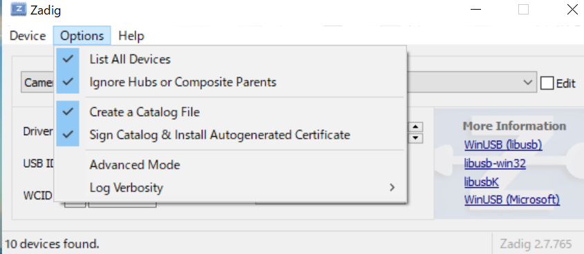
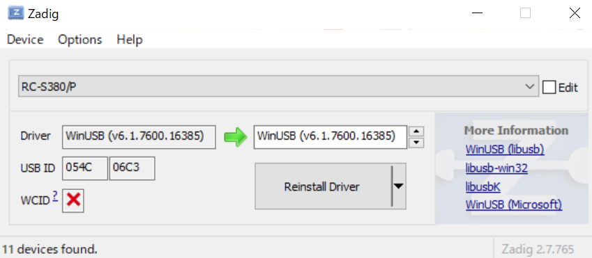
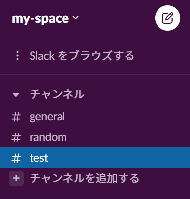
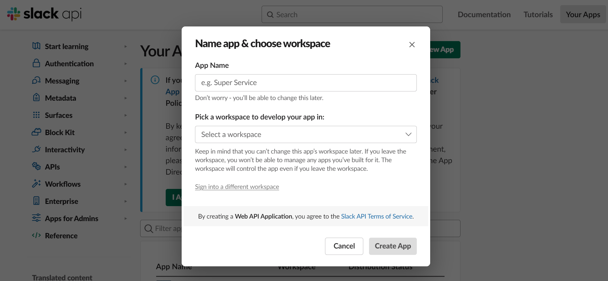
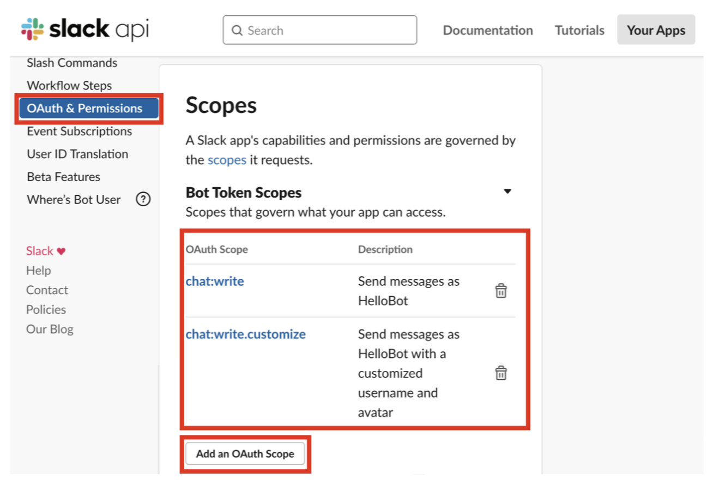
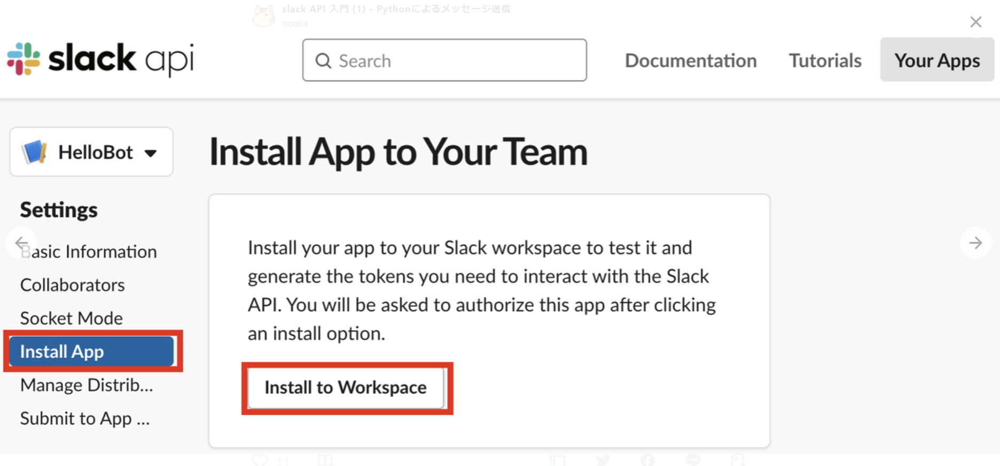
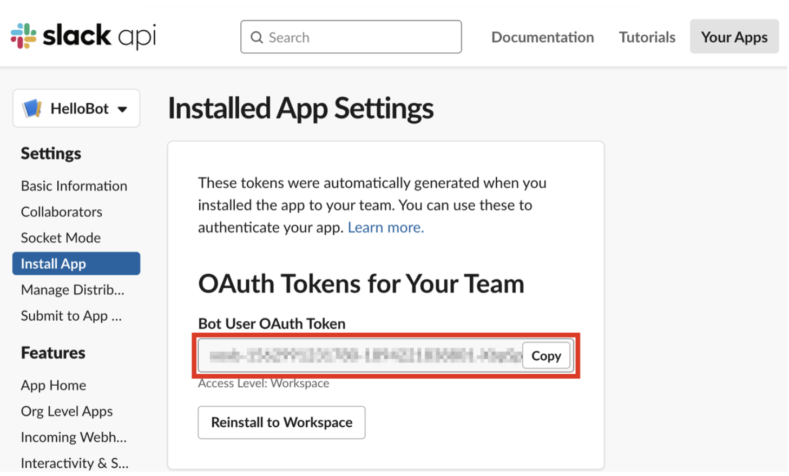
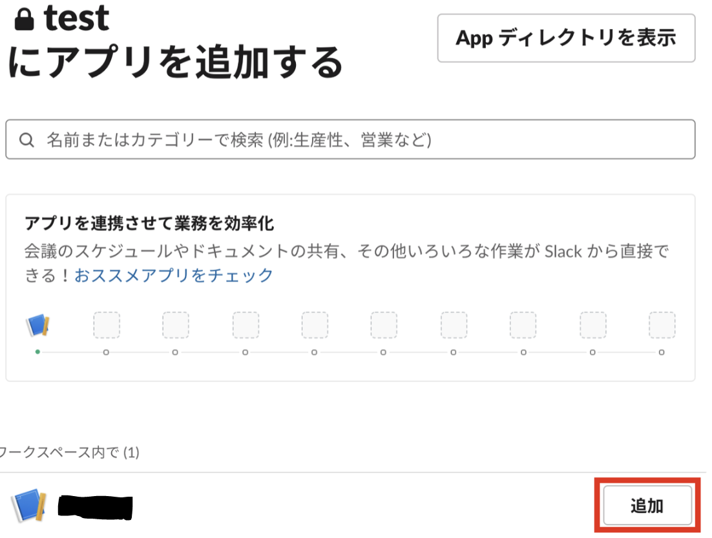

# 在室管理システムの作り方！

## 目次
* [Windows編](#windows編)
  1. [環境](#環境windows)
  1. [WinUSBのインストール](#winusbのインストール)
  1. [libusbのインストール](#libusbのインストール)
  1. [Pythonによるカードリーダー読み込みの実装](#pythonによるカードリーダー読み込みの実装)
  1. [Slack側の準備](#slack側の準備)
  1. [Pythonによる学籍番号の送信](#pythonによる学籍番号の送信)
* [Raspberry Pi編](#raspberry-pi編)
  1. [環境](#環境raspberrypi)
  1. [Pythonによるカードリーダー読み込みの実装](#pythonによるカードリーダー読み込みの実装)
  1. [Slack側の準備](#slack側の準備)
  1. [Pythonによる学籍番号の送信](#pythonによる学籍番号の送信)
  1. [実行方法](#実行の仕方raspi)
* [参照サイト](#参照サイト一覧)

## Windows編

### 環境(Windows)
  * Windows10 64bit
  * Python3.5~3.10
  * PaSoRi(RC-S380) (カードリーダー) 

### WinUSBのインストール
1. [Zadigのサイト](https://zadig.akeo.ie/)からZadigの最新版をダウンロード
(今回は[Zadig2.7](https://github.com/pbatard/libwdi/releases/download/v1.4.1/zadig-2.7.exe)をダウンロード)<br>
1. ダウンロード後、右クリックで管理者として実行
1. GUIが開くので、以下のようにOptions > List All Devicesにチェックを入れる<br>


1. PCのUSB端子にPaSoRi(RC-S380)を接続し、プルダウンメニューからRC-S380と記述されているものを選択<br>
Driverのところで、WinUSB(v6.1.7600.16385)を選択し、Install Driverをボタンを押す。(初回はInstall Driver,2回目以降は、Replace Driver)<br>


### libusbのインストール
1. [ここ](https://github.com/libusb/libusb/releases/tag/v1.0.22)からlibusb-1.0.22.7zをダウンロード(今回は1.0.22版を使います。)
1. 7zipを使って解凍(7zipは[ここ](https://www.7-zip.org/download.html)からダウンロードできます。)
1. 解凍して生成されたフォルダの中から以下の２つのファイルを指定の場所にコピー
    1. MS64dll\libusb-1.0.dllを C:\Windows\System32 へコピー
    1. MS32\dll\libusb-1.0.dll を C:\Windows\SysWOW64へコピー

### Pythonによるカードリーダー読み込みの実装
1. ターミナル(cmd,powershell,Ubuntu,bash,zsh,etc)を立ち上げて、任意のディレクトリ配下に移動
1. 仮想環境の構築&起動&仮想環境内のpipコマンドの更新(自身のPCに直接ライブラリを入れても良い方は飛ばしてOK)
    ```
    python -m venv myvenv
    myvenv\Scripts\activate
    python -m pip install --upgrade pip
    ```
1. nfcpyをインストール
    ```
    pip install nfcpy
    ```
1. 学籍番号を読み込みスクリプトを作る(reader.py)
    ```
    import nfc
    
    def reader():
      
      #接続定義
      clf = nfc.ContactlessFrontend('usb')
      print("タッチしてください")
      
      #タグの取得
      tag = clf.connect(rdwr={'on-connect': lambda tag: False})
      
      #学生証の全情報
      card_info = tag.dump()
      
      #学籍番号の抽出
      student_number = card_info[4][61:68]
      
      #結果表示
      print(student_number)
      return student_number
    ```
### Slack側の準備
1. Slackのワークスペースの準備
    * [Slackのワークスペースを追加する](https://slack.com/get-started#/create)で新しくワークスペースを作る
    * ワークスペースには、testチャンネルを作る<br>
      
2. Slackアプリの準備
    * [slack api](https://api.slack.com/apps)で「Create New App」をクリック
    * From scratchをクリックし、アプリ名とどのワークスペースで使うかを選択する<br>
        * App Name : slackアプリ名
        * Development Slack Workspace : slackのワークスペース<br>
    <br>

    * 「OAuth & Permissions」を選択し、「Scopes」で権限を追加<br>
        * chat:write : メッセージの送信
        * chat:write.customize : ユーザー名とアバターのカスタマイズ<br>
        <br>

    * 「Install App」を選択し、「Install to Workspace」をクリック<br>
    

    * 「許可する」をクリック<br>
    

    * 「トークン」をメモ<br>
    

1. チャンネルへのslackアプリの追加
    * チャンネル名の右クリックの「チャンネル詳細を開く → インテグレーション → アプリを追加」でslackアプリを追加<br>
    
    <br>
    * 「追加」をクリック<br>
    

### Pythonによる学籍番号の送信
1. requestsをインストール
    ```
    pip install requests
    ```

1. slackに学籍番号を送信するスクリプトを作る(slack_post.py)
    ```
    import requests

    def slack_post(student_number):
      TOKEN = 'slackアプリのトークン'
      CHANNEL = 'test'
      
      url = "https://slack.com/api/chat.postMessage"
      headers = {"Authorization": "Bearer "+TOKEN}
      data  = {
        'channel': CHANNEL,
        'text': student_number
      }
      requests.post(url, headers=headers, data=data)

1. 永遠を手に入れる(main.py)
    ```
    import reader,slack_post

    while True:
      student_number = reader.reader()
      slack_post.slack_post(student_number)
    ```

1. 実行！

## Raspberry Pi編

### 環境(RaspberryPi)
  * Raspberry Pi4 Model B/4GB
  * Python3.9.2
  * PaSoRi(RC-S380) (カードリーダー) 

### Pythonによるカードリーダー読み込みの実装
1. ターミナル(cmd,powershell,Ubuntu,bash,zsh,etc)を立ち上げて、任意のディレクトリ配下に移動
1. 仮想環境の構築&起動&仮想環境内のpipコマンドの更新(自身のPCに直接ライブラリを入れても良い方は飛ばしてOK)
    ```
    python -m venv myvenv
    myvenv\Scripts\activate
    python -m pip install --upgrade pip
    ```
1. nfcpyをインストール
    ```
    pip install nfcpy
    ```
1. 学籍番号を読み込みスクリプトを作る(reader.py)
    ```
    import nfc
    
    def reader():
      
      #接続定義
      clf = nfc.ContactlessFrontend('usb')
      print("タッチしてください")
      
      #タグの取得
      tag = clf.connect(rdwr={'on-connect': lambda tag: False})
      
      #学生証の全情報
      card_info = tag.dump()
      
      #学籍番号の抽出
      student_number = card_info[4][61:68]
      
      #結果表示
      print(student_number)
      return student_number
    ```
### Slack側の準備
1. Slackのワークスペースの準備
    * [Slackのワークスペースを追加する](https://slack.com/get-started#/create)で新しくワークスペースを作る
    * ワークスペースには、testチャンネルを作る<br>
      
2. Slackアプリの準備
    * [slack api](https://api.slack.com/apps)で「Create New App」をクリック
    * From scratchをクリックし、アプリ名とどのワークスペースで使うかを選択する<br>
        * App Name : slackアプリ名
        * Development Slack Workspace : slackのワークスペース<br>
    <br>

    * 「OAuth & Permissions」を選択し、「Scopes」で権限を追加<br>
        * chat:write : メッセージの送信
        * chat:write.customize : ユーザー名とアバターのカスタマイズ<br>
        <br>

    * 「Install App」を選択し、「Install to Workspace」をクリック<br>
    

    * 「許可する」をクリック<br>
    

    * 「トークン」をメモ<br>
    

1. チャンネルへのslackアプリの追加
    * チャンネル名の右クリックの「チャンネル詳細を開く → インテグレーション → アプリを追加」でslackアプリを追加<br>
    
    <br>
    * 「追加」をクリック<br>
    

### Pythonによる学籍番号の送信
1. requestsをインストール
    ```
    pip install requests
    ```

1. slackに学籍番号を送信するスクリプトを作る(slack_post.py)
    ```
    import requests

    def slack_post(student_number):
      TOKEN = 'slackアプリのトークン'
      CHANNEL = 'test'
      
      url = "https://slack.com/api/chat.postMessage"
      headers = {"Authorization": "Bearer "+TOKEN}
      data  = {
        'channel': CHANNEL,
        'text': student_number
      }
      requests.post(url, headers=headers, data=data)

1. 永遠を手に入れる(main.py)
    ```
    import reader,slack_post

    while True:
      student_number = reader.reader()
      slack_post.slack_post(student_number)
    ```

### 実行の仕方(RasPi)
1. 実行！
    ```
    sudo python3 main.py show
    ```

1. sudoなしでも実行する方法(yatoiは上手くいかなかった)
    ```
    sudo nano /etc/udev/rules.d/nfcdev.rules
    ```
    以下の1行を書いて保存(nanoの操作：Ctrl+O、Enter、Ctrl+Xです）
    ```
    SUBSYSTEM=="usb", ACTION=="add", ATTRS{idVendor}=="054c", ATTRS{idProduct}=="06c3", GROUP="plugdev" # Sony RC-S380/P
    ```
    再起動
    ```
    reboot
    ```

## 参照サイト一覧
* [【Python】PaSoRiによるICカードの読み取り](https://obenkyolab.com/?p=741)
* [NFCPy](https://nfcpy.readthedocs.io/en/latest/topics/get-started.html)
* [slack API 入門 (1) - Pythonによるメッセージ送信](https://note.com/npaka/n/n4bcb38a1ea74)
* [ラズパイにパソリを繋いでNFCタッチ！](https://monomonotech.jp/kurage/raspberrypi/nfc.html)
